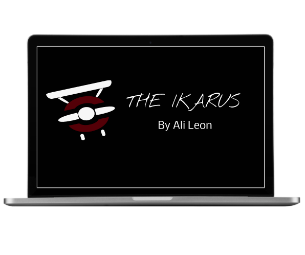

# Headless Shopify Front-End UI fro Meraki Web Test

This is a simple Shopify Ministore UI for Meraki Web Test. It is built using Svelte islands on Astro and Tailwind CSS from Astro Templates.

# import images
  

## Getting Started the UI

To get started, follow these steps:

1. Clone the repository:

```bash
git clone https://github.com/alileonainagas/meraki-headless-shopify-ministore.git
```

1.1 Create a .env file in the root directory of the project and past the Shopify API key and Storefront Access Token provided in the .txt file.

2. Install the dependencies:

```bash
npm install
```

3. Start the development server:

```bash
npm run dev
```
